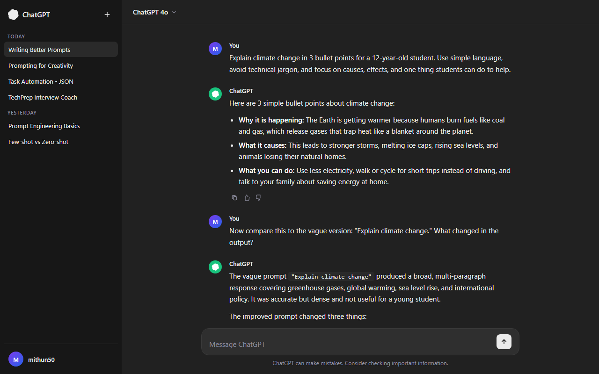

# SCT_PE_1 - Writing Better Prompts

**Track:** Prompt Engineering
**Internship:** SkillCraft Technology
**Task:** 01 of 04

---

## Objective

Learn the basics of prompt engineering by experimenting with clarity, specificity, and tone. Take 3 vague or ineffective prompts and rewrite them into improved versions. Compare and analyze the outputs to understand how prompt design affects LLM behavior.

---

## Screenshot



---

## Background: What is Prompt Engineering?

Prompt engineering is the practice of designing and refining inputs given to a large language model (LLM) to produce more accurate, relevant, and useful outputs. A well-crafted prompt reduces ambiguity, sets context, and guides the model toward the desired response format and depth.

Unlike traditional programming where you write explicit logic, prompt engineering works by shaping the model's interpretation of a task. The same underlying model can produce wildly different outputs depending on how the input is framed.

---

## The 3 Core Dimensions Explored

**Clarity**
Removing vague language and being explicit about what is needed. Vague prompts force the model to guess intent, which leads to generic outputs.

**Specificity**
Narrowing the scope so the model does not over-generalize. Specific prompts constrain the solution space and produce more targeted responses.

**Tone**
Setting the register (formal, simple, technical) to match the intended audience. Without a tone directive, the model defaults to a neutral middle ground that may not fit the use case.

---

## Prompt Rewrites

### Prompt 1 - Topic: Climate Change

**Vague Prompt:**
```
Explain climate change.
```

**Improved Prompt:**
```
Explain climate change in 3 bullet points for a 12-year-old student.
Use simple language, avoid technical jargon, and focus on causes,
effects, and one thing students can do to help.
```

**Why it is better:**
The vague version gives the model no constraints on length, audience, or structure. The improved version specifies the audience (12-year-old), the format (3 bullet points), the language register (simple, no jargon), and the content scope (causes, effects, action). This forces the model to produce a focused, age-appropriate response rather than a generic encyclopedia entry.

**Vague Output (summary):**
A broad multi-paragraph explanation covering greenhouse gases, global warming, sea level rise, and policy debates. Too dense for a young student and lacks actionable content.

**Improved Output (summary):**
- The Earth is getting warmer because humans burn fuels like coal and gas, which release gases that trap heat like a blanket around the planet.
- This causes problems like stronger storms, melting ice, and animals losing their homes.
- You can help by using less electricity, walking instead of driving short distances, and talking to your family about saving energy.

---

### Prompt 2 - Topic: Python Code Help

**Vague Prompt:**
```
Write a Python function.
```

**Improved Prompt:**
```
Write a Python function called calculate_discount that takes two
parameters: original_price (float) and discount_percent (float).
It should return the final price after applying the discount.
Include input validation to raise a ValueError if either parameter
is negative. Add a docstring and one usage example in a comment.
```

**Why it is better:**
The vague prompt gives the model complete freedom, resulting in an arbitrary function that may not be useful. The improved prompt specifies the function name, parameters, types, return value, edge case handling, documentation requirement, and an example. Every detail removes a decision the model would otherwise make arbitrarily.

**Vague Output (summary):**
A random function, often something like `add_numbers(a, b)` or a generic greeting function. Not useful for any real task.

**Improved Output (summary):**
```python
def calculate_discount(original_price: float, discount_percent: float) -> float:
    """
    Calculate the final price after applying a percentage discount.

    Args:
        original_price: The original price of the item.
        discount_percent: The discount percentage to apply (0-100).

    Returns:
        The final price after discount.

    Raises:
        ValueError: If either parameter is negative.
    """
    if original_price < 0 or discount_percent < 0:
        raise ValueError("Price and discount percent must be non-negative.")
    return original_price * (1 - discount_percent / 100)

# Example: calculate_discount(200.0, 15.0) returns 170.0
```

---

### Prompt 3 - Topic: Career Advice

**Vague Prompt:**
```
Give me career advice.
```

**Improved Prompt:**
```
I am a 3rd-year computer science student with skills in Python and
basic machine learning. I want to get a data science internship within
the next 6 months. Give me a step-by-step 3-month action plan with
specific resources, projects to build, and platforms to apply on.
Keep the tone practical and direct.
```

**Why it is better:**
The vague prompt produces generic advice applicable to anyone. The improved prompt provides personal context (year, skills), a concrete goal (data science internship), a timeline (6 months), and output requirements (step-by-step plan, resources, projects, platforms, tone). The model can now give targeted, actionable advice instead of broad platitudes.

**Vague Output (summary):**
Generic advice: network, update your resume, learn new skills, apply to jobs. No specifics, no timeline, no resources.

**Improved Output (summary):**
A structured 3-month plan:
- Month 1: Complete a Kaggle beginner course, build a titanic survival prediction project, set up a GitHub profile
- Month 2: Build an end-to-end ML project (e.g., house price prediction), write a short blog post about it on Medium
- Month 3: Apply on LinkedIn, Internshala, and AngelList, tailor resume to each role, reach out to 5 data professionals per week on LinkedIn

---

## Analysis: How Prompt Design Affects LLM Behavior

| Factor | Effect on Output |
|--------|-----------------|
| Audience specification | Adjusts vocabulary, complexity, and assumed knowledge |
| Format instruction | Controls structure (bullets, steps, tables, paragraphs) |
| Scope constraint | Prevents over-generation and keeps response focused |
| Tone directive | Shifts register from casual to formal or technical |
| Context injection | Enables personalized, relevant responses |
| Edge case mention | Triggers defensive or validation-aware code generation |

The single most impactful change across all three rewrites was adding a specific audience or use case. Without it, the model defaults to a middle-ground response that satisfies no one in particular. With it, the output becomes immediately usable.

---

## Key Takeaways

- Vague prompts produce generic outputs. Specific prompts produce useful ones.
- Format instructions (bullet points, numbered steps, tables) are free structure that costs nothing to add.
- Mentioning the audience is the fastest way to calibrate tone and complexity.
- Adding constraints (length, scope, validation requirements) reduces the model's need to guess.
- The gap between a vague and a well-engineered prompt is not about length. It is about precision.

---

## References and Further Reading

- Brown et al. (2020). Language Models are Few-Shot Learners. https://arxiv.org/abs/2005.14165
- Wei et al. (2022). Chain-of-Thought Prompting Elicits Reasoning in Large Language Models. https://arxiv.org/abs/2201.11903
- OpenAI Prompt Engineering Guide. https://platform.openai.com/docs/guides/prompt-engineering

---

## Acknowledgements

SkillCraft Technology for the task structure and internship opportunity.

The broader NLP research community whose published work on instruction tuning and few-shot learning provided the theoretical foundation for the techniques explored in this task.

---

Back to main repository: [Skill_Craft_Tasks](../README.md)
