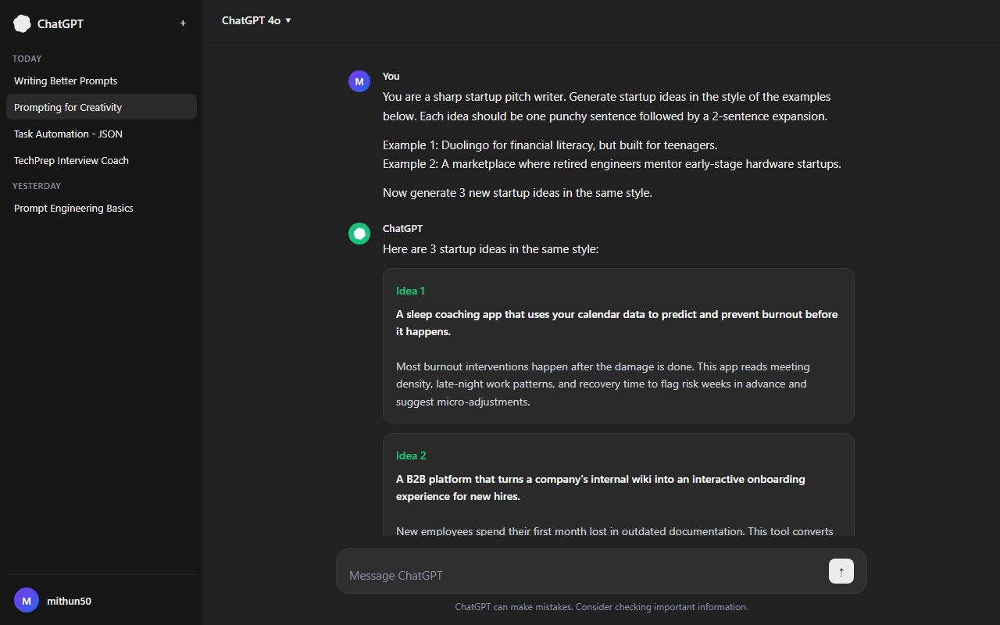

# SCT_PE_2 - Prompting for Creativity

**Track:** Prompt Engineering
**Internship:** SkillCraft Technology
**Task:** 02 of 04

---

## Objective

Explore how prompt structure, tone, and examples influence creative tasks. Use few-shot prompting to guide the model's style or persona. Design a prompt that generates creative outputs, run multiple variants, and compare results for tone, creativity, and detail.

---

## Screenshot



---

## Background: Creativity and LLMs

Large language models are not inherently creative in the human sense. They generate outputs by predicting likely continuations based on patterns in training data. What looks like creativity is actually the model navigating a vast probability space shaped by the prompt.

This means the prompt is the primary lever for creative output. A bare prompt produces the most statistically average response. A well-structured prompt with examples, persona, and constraints pushes the model into less-traveled regions of that space, producing outputs that feel more original and distinctive.

---

## Chosen Task: Generating Startup Ideas

Startup idea generation was chosen as the creative task because the quality gap between a bare prompt and a well-engineered one is immediately obvious. It also tests three different prompting strategies: structured constraints, few-shot examples, and persona-driven prompting.

---

## Variant 0 - Base Prompt (No Guidance)

```
Generate a startup idea.
```

**Output:**
An app that connects freelancers with local businesses.

**Assessment:** Generic and overused. No differentiation, no target market, no unique angle. The model defaulted to the most statistically common startup idea in its training data. This is the baseline to beat.

---

## Variant 1 - Structured Prompt with Constraints

```
Generate one unique startup idea in the sustainability space.
Include: the problem it solves, the target customer, the revenue model,
and one sentence on why now is the right time for it.
```

**Output:**

Idea: A subscription service that converts household food waste into compost and delivers it to urban community gardens.

- Problem: Urban households have no easy way to compost, so food waste ends up in landfills.
- Target customer: Eco-conscious city dwellers aged 25-40 who want to reduce their footprint but lack outdoor space.
- Revenue model: Monthly subscription fee plus a premium tier that delivers a small bag of finished compost back to the subscriber for indoor plants.
- Why now: Municipal composting programs are underfunded, and consumer interest in sustainability has reached a measurable peak post-2023.

**Assessment:** Significantly more useful. The structure forced the model to think through the idea rather than just name it. The output is specific, differentiated, and actionable. The domain constraint (sustainability) also pushed the model away from generic tech startup territory.

---

## Variant 2 - Few-Shot Prompting with Style Examples

```
You are a sharp startup pitch writer. Generate startup ideas in the
style of the examples below. Each idea should be one punchy sentence
followed by a 2-sentence expansion.

Example 1:
Idea: Duolingo for financial literacy, but built for teenagers.
Expansion: Most teens graduate without knowing how credit cards or taxes
work. This app teaches money skills through 5-minute daily challenges
tied to real-world scenarios like buying a car or splitting rent.

Example 2:
Idea: A marketplace where retired engineers mentor early-stage hardware startups.
Expansion: Hardware founders often fail not from lack of funding but from
lack of manufacturing know-how. This platform connects them with vetted
retired engineers from companies like Bosch and GE for paid advisory sessions.

Now generate 3 new startup ideas in the same style.
```

**Output:**

Idea 1: A sleep coaching app that uses your calendar data to predict and prevent burnout before it happens.
Expansion: Most burnout interventions happen after the damage is done. This app reads meeting density, late-night work patterns, and recovery time to flag risk weeks in advance and suggest micro-adjustments.

Idea 2: A B2B platform that turns a company's internal wiki into an interactive onboarding experience for new hires.
Expansion: New employees spend their first month lost in outdated documentation. This tool converts existing Notion or Confluence pages into guided, role-specific learning paths without requiring any manual curation.

Idea 3: A peer-to-peer tool rental network for hobbyists, starting with woodworking and 3D printing equipment.
Expansion: Most hobbyist tools sit unused 90 percent of the time. This platform lets owners rent out equipment by the hour to neighbors, turning idle assets into passive income while lowering the barrier for beginners.

**Assessment:** The few-shot examples established a clear style: punchy opener, practical expansion, specific detail. All three outputs matched the tone and structure precisely. The ideas are original, specific, and investor-pitch-ready. This variant demonstrated the highest structural consistency.

---

## Variant 3 - Persona-Driven Prompt

```
You are a cynical but brilliant Silicon Valley investor who has seen
every startup pitch imaginable. You only get excited about ideas that
solve a real, painful problem in a non-obvious way. Generate one startup
idea that would actually make you lean forward in your chair. Explain
why it excites you in your own voice.
```

**Output:**

Idea: Infrastructure-as-a-service for small funeral homes.

Look, everyone is chasing the next consumer app. Meanwhile, there are 20,000 independent funeral homes in the US running on spreadsheets and fax machines, handling some of the most emotionally sensitive transactions imaginable. Nobody wants to touch this space because it is uncomfortable. That is exactly why I like it. A modern SaaS platform handling scheduling, family communication, compliance paperwork, and payment processing for funeral directors could charge $500 a month per location and face almost zero competition. The TAM is boring on paper and massive in reality. That is the kind of unsexy, durable business that actually compounds.

**Assessment:** The persona completely changed the voice and reasoning style. The output reads like a real investor monologue. The idea itself is unconventional and well-argued. This variant produced the most memorable and distinctive output, demonstrating that persona prompts can unlock a register that structured prompts cannot reach.

---

## Comparison Table

| Variant | Tone | Creativity | Detail | Usefulness |
|---------|------|------------|--------|------------|
| Base prompt | Flat | Low | None | Low |
| Structured with constraints | Neutral, professional | Medium | High | High |
| Few-shot with style examples | Sharp, punchy | High | High | High |
| Persona-driven | Opinionated, distinctive | Very high | Medium-high | High |

---

## Key Findings

**Few-shot examples are the most reliable way to control output style.**
The model mirrors the pattern, tone, and structure of the examples with high fidelity. If you need consistent formatting across multiple outputs, few-shot is the right tool.

**Persona prompts unlock voice and opinion that structured prompts cannot.**
When the model is asked to inhabit a character, it generates outputs that feel authored rather than generated. The investor persona produced an idea that no structured prompt would have surfaced.

**Constraints improve quality even without examples.**
Telling the model what to include (problem, customer, revenue model) produces more complete thinking than leaving it open. Structure is a form of guidance even without stylistic examples.

**The base prompt is a ceiling, not a floor.**
Without guidance, the model regresses to the most common answer in its training distribution. Every additional constraint or example is a step away from that average.

---

## References and Further Reading

- Brown et al. (2020). Language Models are Few-Shot Learners. https://arxiv.org/abs/2005.14165
- Reynolds and McDonell (2021). Prompt Programming for Large Language Models. https://arxiv.org/abs/2102.07350
- OpenAI Prompt Engineering Guide. https://platform.openai.com/docs/guides/prompt-engineering

---

## Acknowledgements

SkillCraft Technology for the internship program and task design.

The AI research community for published work on few-shot learning and in-context learning that informed the prompting strategies explored in this task.

---

Back to main repository: [Skill_Craft_Tasks](../README.md)
